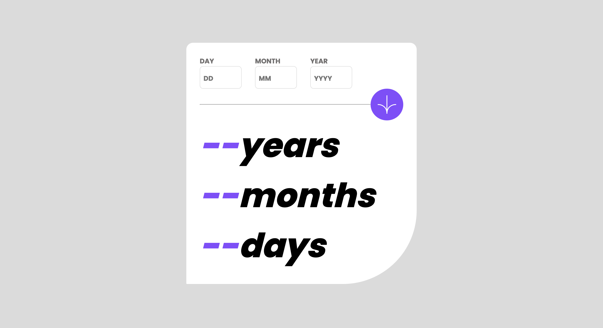

# Age calculator app
## Table of contents

- [Overview](#overview)
  - [Screenshot](#screenshot)
  - [Links](#links)
- [My process](#my-process)
  - [Built with](#built-with)
  - [What I learned](#what-i-learned)
  - [Continued development](#continued-development)
- [Author](#author)

## Overview
### Screenshot

### Links

- Live Site URL: [https://storied-sorbet-9904a0.netlify.app/](https://storied-sorbet-9904a0.netlify.app/)

## My process

### Built with

- HTML5
- CSS
- Flexbox
- JavaScript

### What I learned
- JavaScript functions
- How to use constant and let
- Event handling like clicking the submit button

### Continued development

- Might develop advance feature like real-time loading of age while entering the birthday later.

## Author

- Website - [Srividhya](https://www.linkedin.com/in/srividhya-ranganathan/)
- Frontend Mentor - [@srivi15](https://www.frontendmentor.io/profile/srivi15)
